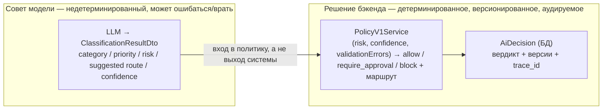

# Архитектура: почему так устроено

README отвечает на «что» и «как». Здесь — «почему»: решения, которые отличают этот сервис от
«дёрнуть LLM и записать ответ». Backend-ценность проекта — не в вызове модели, а в слое между моделью
и действием.

## Граница доверия: совет модели ≠ решение бэкенда

---

### 1. Почему вывод модели — это не решение бэкенда

Модель **предлагает** (категория, приоритет, риск, желаемый маршрут, уверенность). Бэкенд **решает**
(можно ли автоматически, нужна ли аппрува, куда направить). Это разные роли, и их нельзя смешивать:

- вывод модели недетерминированный, модель сменная, а её вход — подконтрольный пользователю текст
  (см. prompt-injection кейсы в golden-eval);
- если бы маршрут диктовала модель, то «реши за меня» уехало бы во внешний недетерминированный
  компонент, который атакующий частично контролирует.

Поэтому `ClassificationResultDto` — это **вход** в политику, а не выход сервиса. Что бы модель ни
вернула, итоговое решение принимает детерминированный код, который мы держим в голове, тестируем и
аудируем.

### 2. Зачем отдельный policy-слой

Бизнес-правила (что считается рискованным, когда нужна ручная аппрува, порог уверенности) должны быть
детерминированными, тестируемыми в изоляции, версионированными и **независимыми от того, какая модель и
какой промпт** породили классификацию.

`PolicyV1Service` — чистая функция `(risk, confidence, validationErrors) → вердикт + маршрут`. Отсюда:

- её можно проверить на точных границах (`confidence` 0.59 vs 0.60) без живой модели — модель такую
  точность не воспроизведёт (`PolicyDecisionTest`, фикстуры `policy_boundary`);
- правила видны в коде и в аудите, а не растворены в тексте промпта;
- смена модели/промпта не меняет правила маршрутизации.

Если бы правила жили в промпте — они были бы недетерминированными, непроверяемыми на границах и
невидимыми для аудита. Это и есть основная инженерная ценность проекта.

### 3. Почему идемпотентность — на уровне БД

Дедуп — уникальный индекс `(tenant_id, external_id)` + `INSERT … ON CONFLICT DO NOTHING`, а **не**
проверка «сначала `findOne`, потом `insert`».

Проверка-перед-вставкой — это TOCTOU: два параллельных сабмита (два воркера, повторная доставка
вебхука, ретрай клиента) пройдут `findOne` одновременно, оба увидят «нет записи» и оба вставят дубль.
Уникальный констрейнт в БД — единственный источник правды; `wasCreated` (1 vs 0 затронутых строк)
**атомарно** говорит, выиграли ли мы вставку. Идемпотентность должна держаться под конкуренцией —
значит, жить там, где конкуренция реально сериализуется: в базе.

(Краш-рекавери — следствие: guard смотрит на наличие *решения*, а не на «новизну» тикета, поэтому
принятый-но-не-классифицированный тикет доклассифицируется при повторе, а не теряется и не дублируется.)

### 4. Зачем версионировать schema / prompt / policy

Решение, принятое сегодня, должно быть объяснимо и воспроизводимо **после** смены модели, промпта,
схемы или правил. Каждое `AiDecision` хранит `schema_version` / `prompt_version` / `policy_version` /
`model`. Это даёт:

- **воспроизводимость** — поднять ту же тройку версий и повторить решение;
- **диффинг** — сравнить поведение v1 и v2 на одном наборе;
- **атрибуцию регрессии** — привязать просадку качества к конкретному изменению (новый промпт? новая
  модель?);
- **безопасную миграцию** — v2 живёт рядом с v1, старые решения не переписываются задним числом.

Без версий аудит-лог — это снимок, которому нельзя доверять и который нельзя воспроизвести.

### 5. Почему невалидный вывод модели аудируется, а не падает

Модель, вернувшая мусор (битый enum, `confidence` вне диапазона, отсутствует обязательное поле) —
это **штатное состояние**, а не исключение. Три варианта реакции:

- бросить исключение → тикет потерян, сбой шумит, но работа не сделана;
- молча подставить дефолт → тихое неверное решение, худший вариант для аудита;
- **сохранить решение со статусом `failed` + `validationErrors`, политика → `manual_triage`** → ничего
  не теряется, каждый провал модели виден в аудит-трейле, тикет забирает человек.

Выбран третий: fail safe > fail loud > fail silent. Это зафиксировано фикстурами `model_failure`
(`PolicyDecisionTest`) — невалидный вывод детерминированно уходит в `blocked` / `manual_triage`.

---

## Известные ограничения

Осознанный скоуп демо-проекта, а не недосмотр. Перечислено честно — каждое ограничение имеет понятный
путь доработки и не ломает архитектуру выше:

| Ограничение | Почему сейчас так / куда расти |
|---|---|
| **Нет auth на HTTP-эндпоинте** | `POST ticket/add` открыт. В проде — токен/HMAC-подпись источника или mTLS на ingress. |
| **Нет rate limiting** | Один тикет = один синхронный вызов модели = деньги и латентность. Нужен лимитер per-tenant. |
| **Нет очереди / async-обработки** | Классификация синхронна в рамках запроса. Под нагрузкой приём и классификацию надо развести: ingest → очередь → воркер. Идемпотентность на уровне БД для этого уже готова. |
| **OpenRouter включается вручную через DI-binding** | Переключение `FakeClassifier` ↔ `OpenRouterClassifier` — правка одной строки в `container.php`, не env/runtime-флаг. Сознательно: не плодим конфиг-уровни раньше нужды. |
| **Golden-eval стоит денег и зависит от модели** | Прогон бьёт реальную модель (N вызовов) и гейтится на `OPENROUTER_API_KEY`; ожидания намеренно гибкие, но это не детерминированный тест. Policy-слой покрыт детерминированно отдельно. |
| **Нет интеграции с реальным источником тикетов** | Вход — JSON-файл (CLI) или HTTP-тело. Реального коннектора (почта, Zendesk, вебхук) нет; `IngestTicketCommand` — точка, куда такой адаптер встанет. |
| **Нет PII-редактирования** | Тело тикета уходит в модель и в БД как есть. В проде перед отправкой в модель и логи нужен redaction чувствительных данных (карты, e-mail, телефоны). |

Ничего из этого не требует переделки доменного ядра — все точки расширения (`TicketClassifierInterface`,
`IngestTicketCommand`, DI-контейнер, версионированные контракты) уже на месте.
